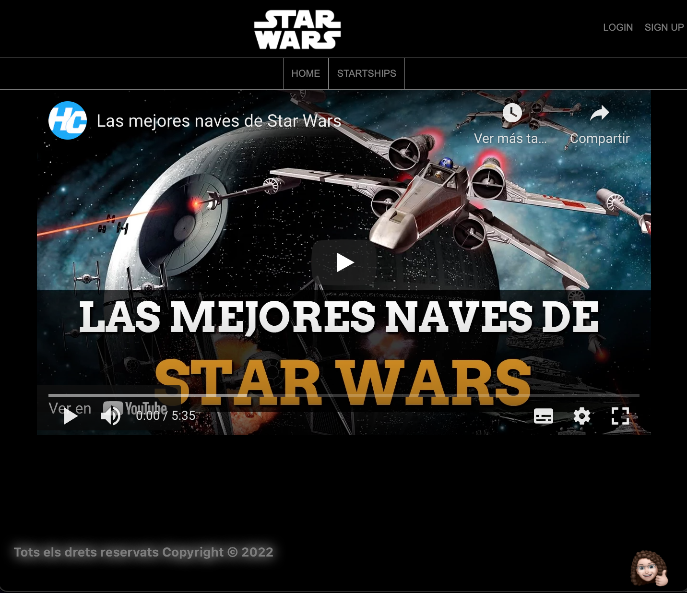
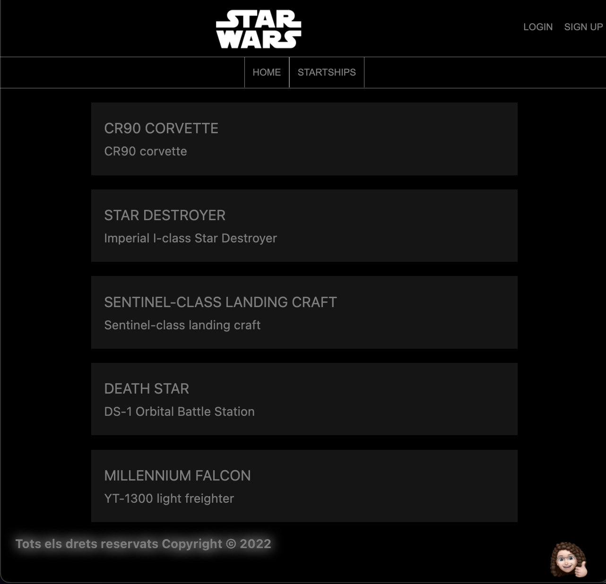
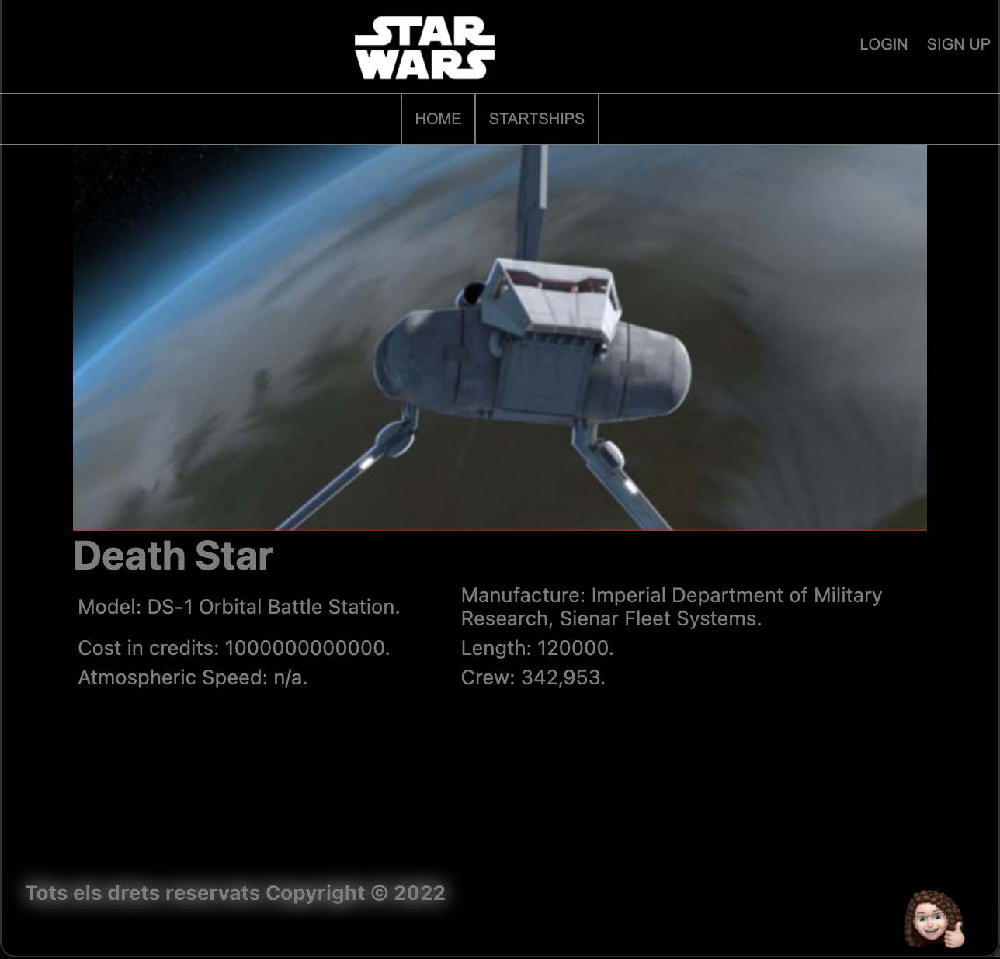
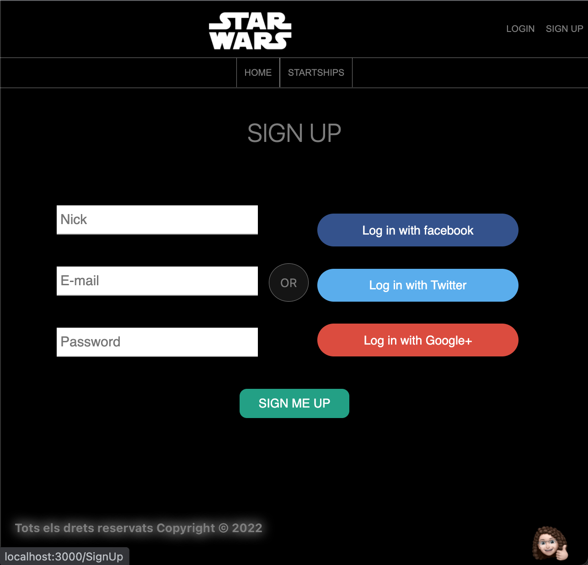

# S8.StarWars

Este proyecto hace un consumo de datos de API, mostrarlos por pantalla en un listado, e implementar el detalle de cada item del listado.
La web que he desarrollar es una web de información sobre las naves de Star Wars. Muestraro el listado de naves, y al clicar en una se ve los detalles de ésta.

## Visualización Home:

## Visualización de naves:

## Visualización Sing Up:

